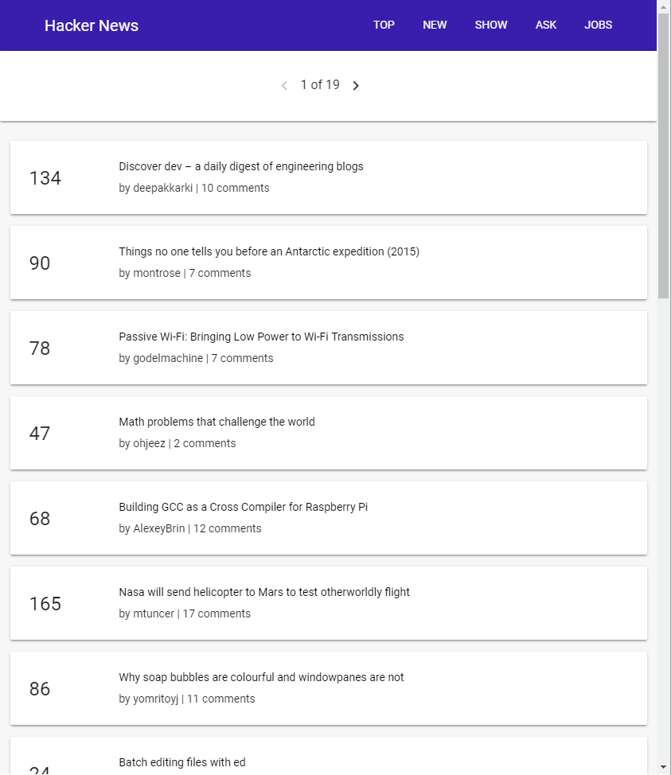
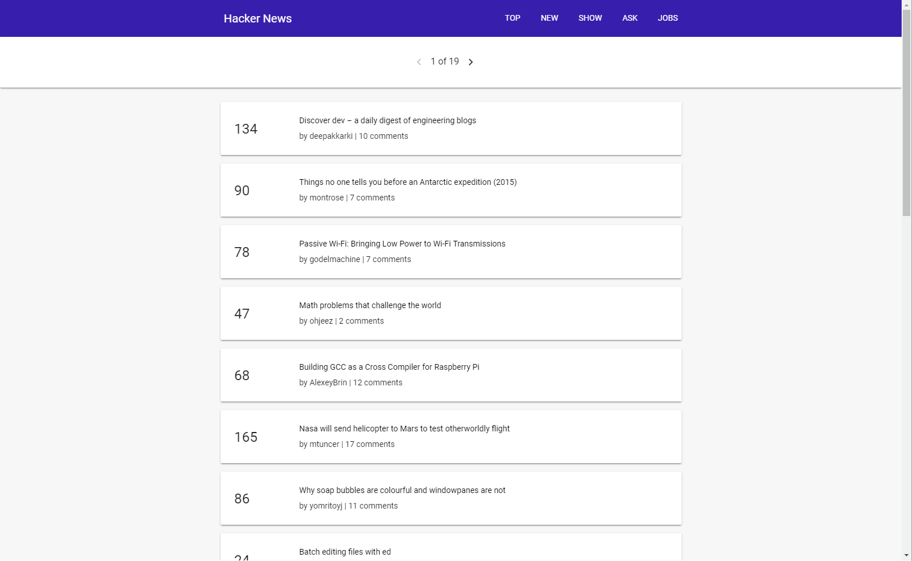

# Angular 6.0 Hacker News

A Hacker News Progressive Web App (PWA) built using:

* Angular 6.0
* @angular/pwa
* @angular/material
* Flexbox and Media queries
* Workbox (For caching data with service worker)
* Hacker News API

See it live: [Hacker News PWA](https://ng6-hacker-news-pwa.firebaseapp.com)

This project was generated with [Angular CLI](https://github.com/angular/angular-cli) version 6.0.0.

# Why build this project?

* It's a **Progressive Web App (PWA)** which utilizes **Offline First** techniques and **app-like** behaviour. Feel free to refresh the page when offline and see the cached data at work. The best way to learn about a new technology is to build a project out of it.
* This application follows modern **Responsive Web Design** techniques with the help of **flexbox** and **media queries** to provide a responsive design according to content of the site and not according to different device sizes with fixed width only.
* This project was built for **Udacity's Google Mobile Web Scholarship Track**.

# Screenshots

The screenshots only give a brief overview of the application's responsive design.

### Mobile View


### Tablet View


### Desktop View


# Installation Guide

Run the following commands:

```
git clone https://github.com/anurag-majumdar/hacker-news-PWA.git
cd hacker-news-PWA
npm install
```

# Development Server

Run `ng serve --aot` for a dev server. Navigate to `http://localhost:4200/`. The app will automatically reload if you change any of the source files.

# Build & Run With Service Worker

To build the app with service worker support please follow the steps:
1. Run `npm run workbox-build`. This is a custom npm script which runs `ng build --prod` and `workbox generateSW` to create a `dist` directory and generate the service worker file `sw.js` and put it inside `dist` directory.

```
npm run workbox-build
```

2. To see the application at work from `dist` directory, run the following commands:

```
npm install -g serve
cd dist
serve -p 8080
```

# Future Updates

* Add user details page for each user.
* Add comments page for each project.

# Contributions
Feel free to fork this repo and send me a Pull Request if you find any bug or want to extend the functionality of this app. Also, use the issues section to post any issues if you find them.

# Further help

To get more help on the Angular CLI use `ng help` or go check out the [Angular CLI README](https://github.com/angular/angular-cli/blob/master/README.md).
